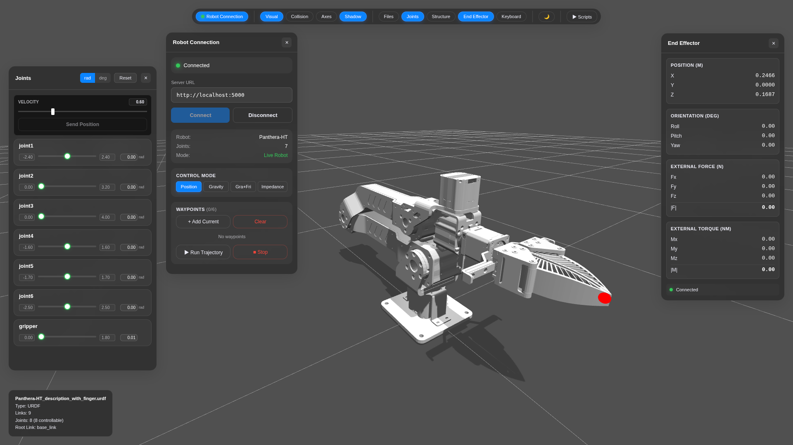
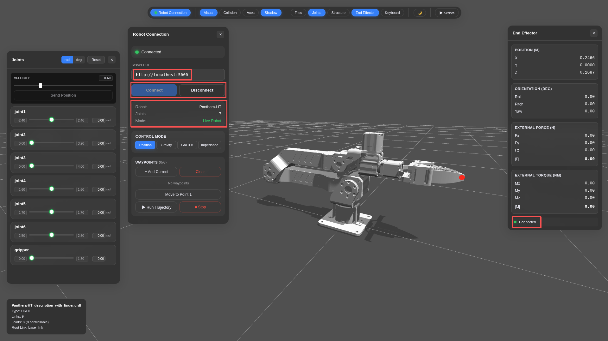
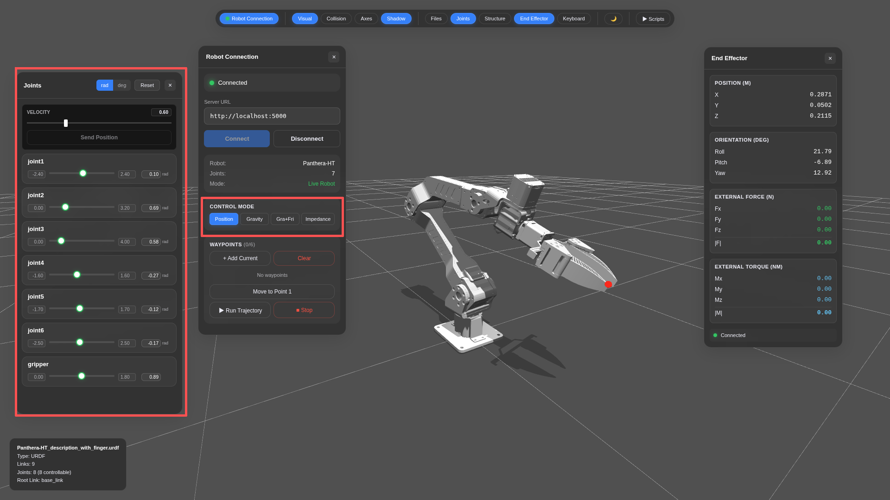
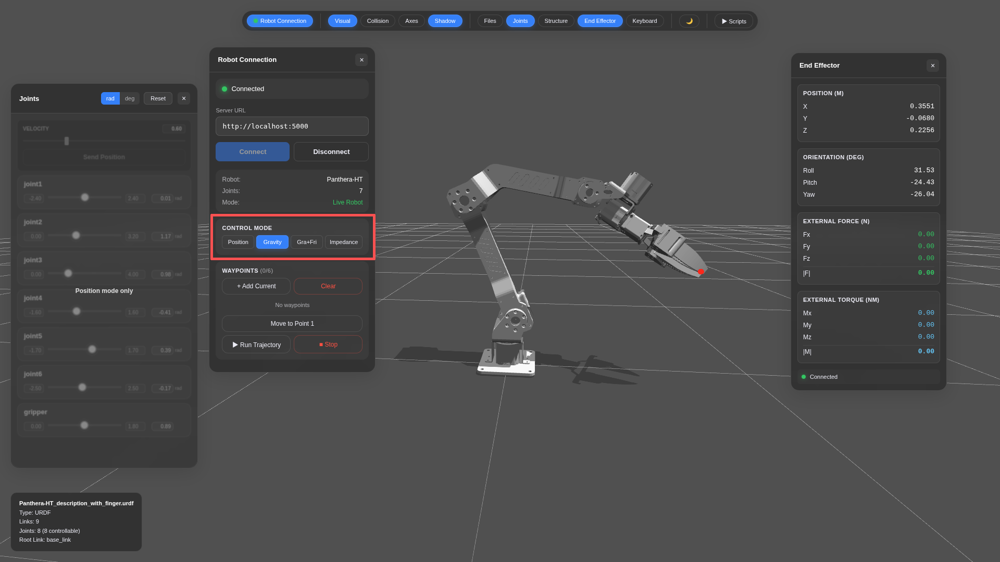
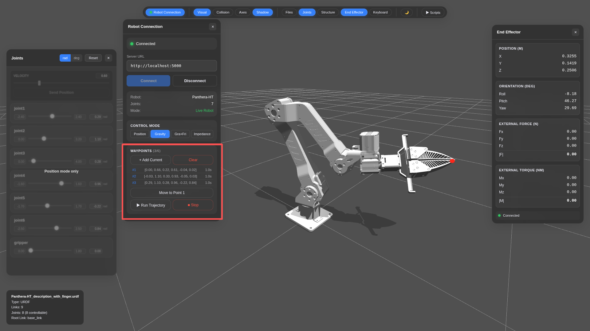
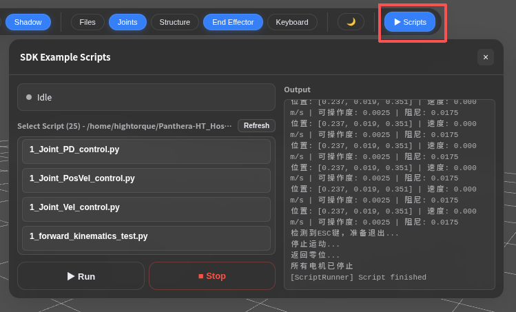

# Panthera-HT Host

[](README.md#中文)[](README_en.md#english)



这是 Panthera-HT 机械臂的上位机项目。包含真机控制SDK示例和前后端。项目主要用于：

- 连接 Panthera-HT 真机并进行位置、重力补偿、阻抗等控制
- 在浏览器中实时显示机械臂 3D 状态、关节状态和末端状态
- 从 Web 页面运行 `panthera_python/scripts/` 下的 SDK 示例脚本
- 在没有真机时使用 Demo 仿真模式调试前后端界面

## 界面基本介绍

### 默认开启面板
启动后界面分为左右两个区域：

**左侧**：`Joints`是机械臂关节位置速度控制面板，在其右侧`Robot Connection`为机械臂连接状态和基础控制模式切换面板。

**右侧**：`End Effector`为位姿面板，由上到下分别显示位置、姿态、外力及力矩。

### 顶部导航栏功能

| 序号 | 页面名称 | 功能说明 |
| --- | --- | --- |
| 1 | 视觉 | 开关机械臂显示 |
| 2 | 碰撞 | 开关机械臂碰撞体积显示 |
| 3 | 坐标轴 | 开关机械臂坐标轴 |
| 4 | 阴影 | 开关机械臂阴影效果 |
| 5 | 文件 | 开关文件面板 |
| 6 | 关节 | 开关关节控制面板 |
| 7 | 结构 | —— |
| 8 | End Effector | 开关位姿面板 |
| 9 | Keyboard | 开关键盘控制面板 |
| 10 | Scripts | 运行SDK控制脚本 |

## 快速启动

### 1. 准备环境

使用 Ubuntu20/22/24，并提前安装 Miniconda 或 Anaconda。

先给脚本执行权限：

```bash
chmod +x install.sh install_oneclick.sh backend.sh frontend.sh
```

根据你的情况选择安装方式：

- 如果之前已经按照 [panthera_python/README.md](panthera_python/README.md) 配置过 Python SDK 的 `panthera` 环境，直接运行：

```bash
./install.sh
```

- 如果还没有配置过 `panthera` 环境，可运行一键安装脚本：

```bash
./install_oneclick.sh
```

若其中 npm install 过程有报 warning，可以尝试以下命令：
```bash
npm audit fix --force
```

`./install.sh` 只安装数字孪生相关依赖，并构建前端页面；`./install_oneclick.sh` 会自动创建/更新 `panthera` 环境，安装机械臂 SDK 和数字孪生依赖。

### 2. 确认真机连接

启动前请确认：

- 机械臂周围安全，没有人或障碍物。
- 电源、串口/CAN 设备已经连接好。
- 使用了正确的机器人配置文件。
- 在panthera环境中运行`0_robot_get_state.py`可以正常读取状态

### 3. 启动后端

新开一个终端，启动真机后端，默认使用本机5000端口，然后机械臂关节会处于锁死状态：

```bash
./backend.sh
```

这等价于：

```bash
./backend.sh --live --config ../../panthera_python/robot_param/Follower.yaml --port 5000
```

如果没有连接真机，只想熟悉界面或调试前后端，可以启动 Demo 模式：

```bash
./backend.sh --demo
```

### 4. 打开页面

浏览器打开后端地址：

```text
http://localhost:5000
```

后端会直接托管已经构建好的前端页面。看到页面后，就可以在浏览器里查看机械臂状态、控制关节、运行示例脚本。

注意：只有开发或修改前端代码时，才需要单独启动前端开发服务器：

```bash
./frontend.sh
```

前端开发服务器默认地址是 `http://localhost:3000`，支持热更新。修改前端源码后，如果希望 `5000` 端口显示最新页面，需要重新执行 `./install.sh` 或在前端目录`Panthera_digital_twin-main/frontend`中运行 `npm run build`。

## 使用教程

### 1. 打开页面并确认连接状态

启动后端后，浏览器访问：

```text
http://localhost:5000
```

页面打开后先看顶部或侧边状态信息：

<p align="center">
  
</p>

- `Robot Connection`面板：
  - Connect：连接机械臂
  - Disconnect：断开当前连接
  - Joints显示7个表示为6个关节+1个夹爪。
- `End Effector`面板底部`Connected`表示当前真机连接；`Demo Mode` 则表示当前是仿真模式，不会控制真实机械臂。
- `Robot Connection`面板中，注意Server URL要与启动的配置一致，如果没有修改，就按照默认设置即可。

### 2. 使用 3D 视图观察机械臂

页面中央是机械臂 3D 模型：

- 模型姿态会根据后端关节状态实时更新。
- 红色小点表示末端执行器位置。
- 鼠标左键拖动可以旋转视角，滚轮可以缩放视角。

如果更新了 URDF 或模型文件，需要重启后端并刷新页面。

### 3. 使用 Joints 面板控制关节

<p align="center">
  
</p>

在 `Joints` 面板中可以查看和调整 6 个关节的位置。

若机械臂在连接时未处于零位，则此时可以点击`Reset`按钮回到零位。

常用操作：

- 拖动关节位置滑条，调整单个关节目标位置。
- 在数值输入框中输入角度值，进行更精确的调整。
- 使用速度滑条或速度输入框调整发送位置指令时的速度，默认值是 `0.6`。
- 点击 `Send Position`，把当前 6 个关节目标位置发送给后端。
- 点击 `Reset`，让 6 个关节回到零位。

Demo 模式下可以放心熟悉界面；真机模式下每次发送指令前都要确认机械臂周围安全。

### 4. 使用 CONTROL MODE 切换控制模式

<p align="center">
  
</p>

`Robot Connection` 浮窗中的 `CONTROL MODE` 用来切换后端控制方式。

预设模式：

- `Position`：位置控制模式。`Joints` 面板中的关节位置和 `Send Position` 需要在这个模式下使用。
- `Gravity`：重力补偿模式。机械臂进入可手动拖动的浮动状态，适合手动示教。
- `Gra+Fri`：重力 + 摩擦力补偿模式。在 `Gravity` 的基础上增加摩擦力补偿，手动拖动时阻力感会不同。
- `Impedance`：阻抗控制模式。机械臂会围绕当前目标位置做柔顺控制，可用于外力交互和力方向反馈观察。

注意：

- 从 `Gravity`、`Gra+Fri` 或 `Impedance` 切回 `Position` 时，后端会使用平滑回零策略，避免突然跳变。
- `Gravity` 和 `Gra+Fri` 模式下，夹爪会释放，方便手动移动。
- `Impedance` 模式下，夹爪会使用轻量 MIT 保持控制。


### 5. 使用 WAYPOINTS 规划轨迹

<p align="center">
  
</p>

`Waypoints` 区域用于记录多个关节姿态，并让机械臂按顺序执行轨迹。

基本流程：

1. 先在 `Joints` 面板调整机械臂到一个目标姿态（或用重力补偿模式手动拖动到目标姿态）。
2. 点击 `+ Add Current`，把当前姿态保存为一个 waypoint。
3. 继续调整机械臂姿态，再添加新的 waypoint。
4. 根据需要设置每个 waypoint 的执行时间。
5. 点击`Position`切换回位置速度控制模式，回到零位后点击 `Run Trajectory`，机械臂会按顺序经过这些 waypoint。

轨迹执行时后端会做平滑插值。真机模式下使用前请先确认每个 waypoint 都在安全空间内，不要让轨迹穿过桌面、夹具或人体附近。

### 6. 运行 SDK 示例脚本

<p align="center">
  
</p>

`Scripts` 面板会读取：

```text
panthera_python/scripts/
```

运行步骤：

1. 在 `Select Script` 中选择脚本。
2. 点击运行按钮启动脚本。
3. 观察页面状态和后端终端输出。
4. 如果更新了 `panthera_python/scripts/` 里的脚本，点击 `Refresh` 刷新按钮重新读取列表。

真机模式下脚本会直接控制机械臂。运行前建议先打开脚本文件确认脚本的实际内容。

### 7. 推荐的新手流程

第一次使用建议按这个顺序：

1. 执行 `./install_oneclick.sh` 一键安装环境、SDK 和数字孪生依赖。
2. 执行 `./backend.sh --demo` 启动 Demo 后端。
3. 打开 `http://localhost:5000`。
4. 在 `Joints` 面板拖动关节并点击 `Send Position`。
5. 尝试切换 `CONTROL MODE`，理解不同模式的用途。
6. 添加几个 `WAYPOINTS`，在 Demo 模式下运行一段简单轨迹。
7. 确认 3D 模型动作正常后，再尝试运行简单脚本。
8. 熟悉流程后，再切换到真机模式。

## 项目目录

```text
.
├── install.sh                         # 安装数字孪生依赖
├── install_oneclick.sh                # 新手一键安装：环境 + SDK + 数字孪生
├── backend.sh                         # 启动后端
├── frontend.sh                        # 启动前端开发服务器
├── Panthera_digital_twin-main/
│   ├── backend/                       # Flask 后端
│   ├── frontend/                      # Web 前端
│   ├── robot_param/                   # 机器人配置
│   └── Panthera-HT_description/       # URDF 和模型资源
└── panthera_python/
    ├── scripts/                       # SDK 示例脚本
    ├── motor_whl/                     # 电机 SDK wheel
    └── requirements.txt               # Python 依赖
```

## 常改文件

- 后端入口：`Panthera_digital_twin-main/backend/app.py`
- Demo 仿真：`Panthera_digital_twin-main/backend/panthera_sim.py`
- 前端入口：`Panthera_digital_twin-main/frontend/src/main.js`
- 前端界面：`Panthera_digital_twin-main/frontend/src/ui/`
- 示例脚本：`panthera_python/scripts/`
- 默认真机配置：`panthera_python/robot_param/Follower.yaml`

Web 页面顶部的 `Scripts` 面板会读取 `panthera_python/scripts/` 目录下的一层 `.py` 文件。

## 常用命令

```bash
# 安装数字孪生依赖
./install.sh

# 新手一键安装：环境 + SDK + 数字孪生
./install_oneclick.sh

# 启动后端：Demo 模式
./backend.sh --demo

# 启动后端：真机模式
./backend.sh

# 启动前端开发服务器（仅开发前端时需要）
./frontend.sh

# 指定前端开发服务器端口
./frontend.sh --port 3001

# 重新构建前端，让 5000 端口显示最新页面
cd Panthera_digital_twin-main/frontend
npm run build

# 重新安装数字孪生依赖并构建前端
./install.sh
```

## 常见问题

### 没有真机怎么开发？

使用 Demo 模式：

```bash
./backend.sh --demo
```

### 前端页面打不开？

正常使用时只需要确认后端已经启动，并访问：

```text
http://localhost:5000
```

如果你是在开发前端，才需要启动前端开发服务器：

```bash
./frontend.sh
```

此时访问 `http://localhost:3000`。如果 3000 端口被占用，可以用 `./frontend.sh --port 3001` 换端口。

### 后端找不到 conda 环境？

先按照 [panthera_python/README.md](panthera_python/README.md) 手动安装 `panthera` conda 环境和机械臂 SDK，然后运行：

```bash
./install.sh
```

如果需要重装数字孪生依赖，直接重新执行 `./install.sh` 即可。`./install.sh` 不会创建或删除 `panthera` 环境，也不会安装机械臂 SDK。

### 需要跳过系统依赖安装？

如果只想安装数字孪生的 conda、Python 和 npm 依赖，不想修改系统依赖：

```bash
INSTALL_SYSTEM_DEPS=0 ./install.sh
```

## 更多说明

真机模式和 `panthera_python/scripts/` 下的脚本可能直接控制实际硬件，运行前请先确认脚本内容和现场安全。
