<a id="中文"></a>

# Panthera-HT 🐆

<!-- [](#english)[](#中文) -->

[](#中文)[](#english)

面向学生、创客、教学实验和机器人学习开发的开源六轴机械臂平台。

> 官方网站：[Panthera-HT Hub](https://hightorque.cn/Panthera-HT_Hub/)

<div align="center">
  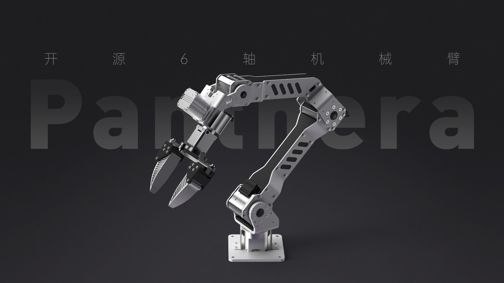
</div>

Panthera-HT 是一款开源六轴机械臂，使用高擎机电的行星关节模组。我们面向开发者提供可复用的统一控制接口，用于算法验证、课程实验、系统集成、具身智能数据采集及二次开发的标准化软硬件实验平台。

机械臂现有的控制方式包括 C++、Python 和 ROS2，拥有的一些功能：位置/速度/力矩控制、阻抗控制、重力补偿模式、重力补偿-摩擦力补偿模式、主从遥操（双臂）、拖动示教等。此外，还支持在 LeRobot 框架下进行数据采集和推理。最新开发 Demo 已覆盖视觉伺服、GraspNet 抓取位姿估计、视觉跟踪色块等方向，更多运行脚本请参考 SDK 文档。

## ✨ 项目起源与初心

这个项目的初心是**让学生党能以更低的价格玩到更高性能的关节电机机械臂**。

项目最初源自 [Ragtime-LAB/Ragtime_Panthera](https://github.com/Ragtime-LAB/Ragtime_Panthera) 的开源工作，我们在此基础上进行了完善和优化。感谢原作者 [wEch1ng(芝士榴莲肥牛)](https://github.com/wEch1ng) 的无私分享和开源精神！

为了方便学生学习**如何从0到1搭建和控制机械臂**，我们将从结构设计到控制算法统统开源，让每个人都能深入理解机械臂的工作原理。

后来项目原作者与高擎一拍即合，在高擎的支持下将项目完善落地，做成了一个更加完善的创客产品。但我们始终坚持开源理念，不对项目作出任何限制。

## 💡 设计理念

### 低成本 + 高性能

- **钣金框架**：选择高性价比的钣金作为整体框架，保证强度的同时降低成本
- **3D打印 + CNC加工**：配合3D打印和三轴CNC加工，实现灵活的结构设计
- **高性能关节模组**：使用高擎机电的行星关节模组，在成本和性能间取得平衡

### 完全开源 + 可扩展

- **结构开源**：提供 SolidWorks 原始设计文件、钣金展开图、3D 打印 STL 文件
- **算法开源**：从底层控制到高级算法，所有代码完全开源
- **无限制修改**：你可以根据需求自由更换电机、修改结构、改变外观
- **模块化设计**：方便进行二次开发和功能扩展

## 📷 项目图片

<div align="center">
  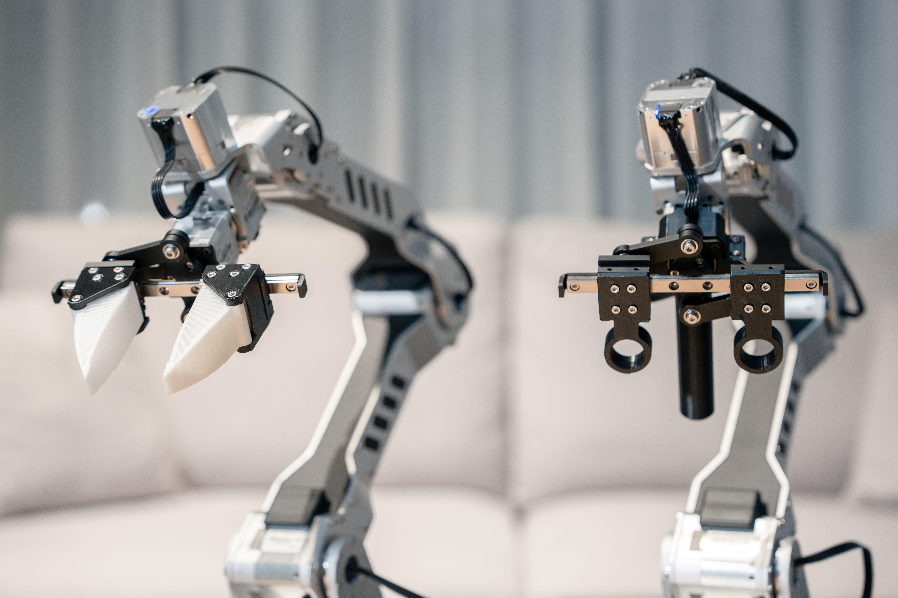
  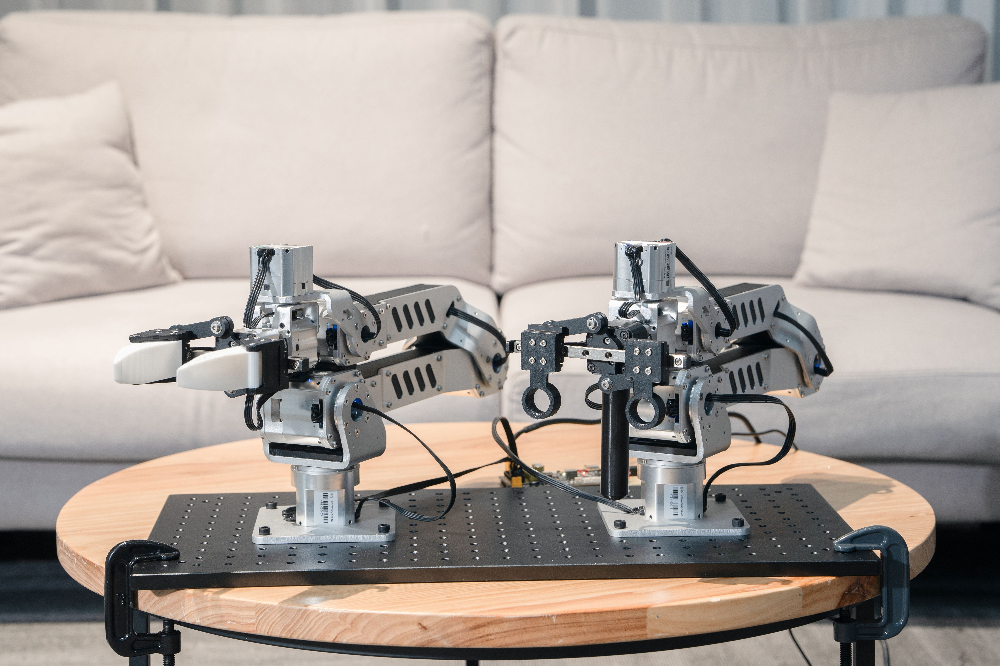
  <br/>
  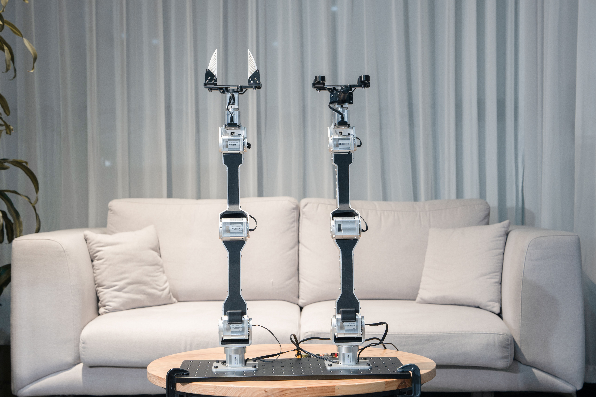
  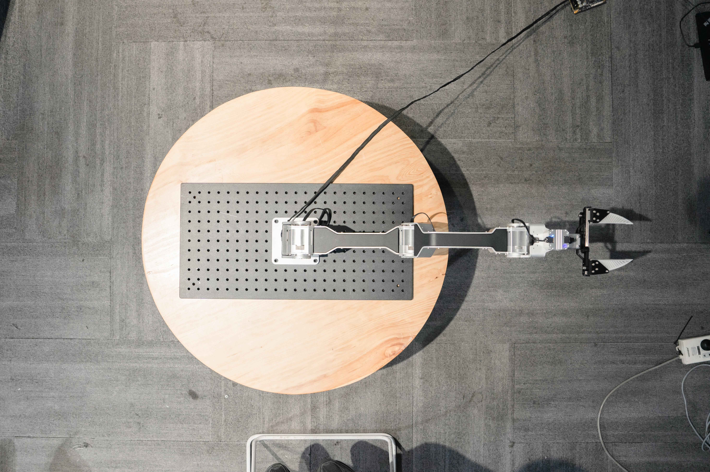
  <br/>
  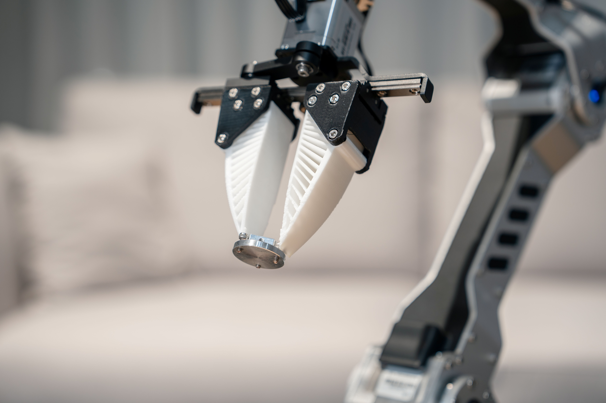
  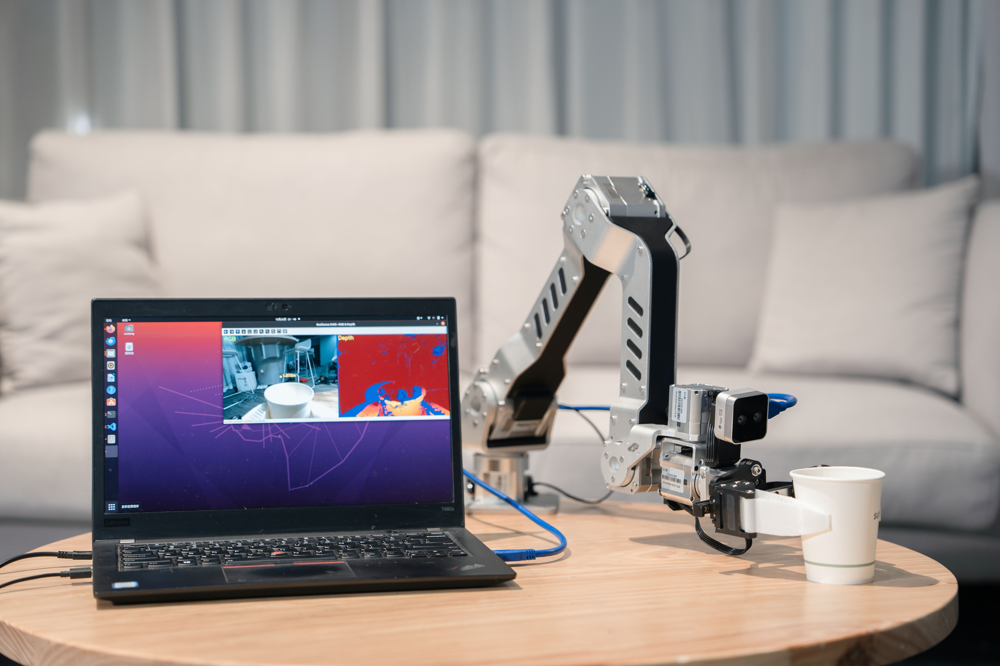
</div>

## ⚙️ 控制示例

### 位置速度控制：
<div align="center">
  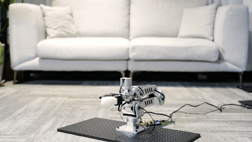
</div>

### 主从遥操：
<div align="center">
  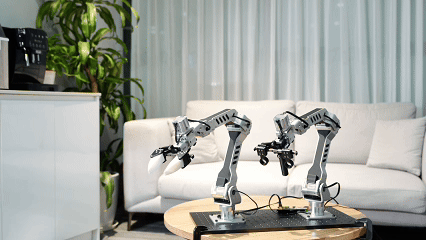
</div>

### 主从遥操抓取：
<div align="center">
  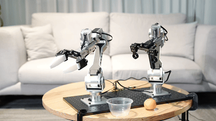
</div>

## 🧭 能力状态

| 方向       | 已支持                                 |
| ---------- | -------------------------------------- |
| 基础控制   | 位置控制、速度控制、力矩控制、阻抗控制 |
| 补偿控制   | 重力补偿、重力补偿-摩擦力补偿          |
| 遥操作     | 双臂主从遥操、拖动示教                 |
| 视觉能力   | 视觉伺服、色块视觉跟踪                 |
| 抓取能力   | GraspNet 抓取位姿估计 Demo             |
| 机器人学习 | LeRobot 数据采集与推理                 |
| ROS2 生态  | 驱动、控制与仿真支持                   |

## 🎯 适合的应用场景

- **高校课程实验**：用于运动学、动力学、电机控制、通信协议、ROS2、机器人感知等课程教学。
- **机器人社团与创客项目**：以较低门槛完成机械臂结构搭建、控制调试和 Demo 展示。
- **从理论到实物的完整实践**：帮助学生和创客理解机械结构设计、控制算法和真实硬件调试流程。
- **黑客松快速开发**：快速组合机械臂、相机、夹爪和算法模块，完成短周期项目验证。
- **视觉抓取算法验证**：用于视觉伺服、GraspNet 抓取位姿估计、色块跟踪、点云处理等实验。
- **具身智能数据采集**：结合主从遥操、拖动示教和 LeRobot，采集模仿学习数据。
- **ROS2 控制与仿真教学**：用于驱动开发、控制链路、仿真环境和系统集成训练。

## 🗃️ 其他仓库

| 仓库                                                                                          | 许可证         | 描述                                                            |
| ----------------------------------------------------------------------------------------------- | -------------- | --------------------------------------------------------------- |
| **[Panthera-HT_SDK](https://github.com/HighTorque-Robotics/Panthera-HT_SDK)**                   | [MIT](LICENSE) | C++/Python SDK 开发包，提供快速上手的示例代码与开发工具链。     |
| **[Panthera-HT_Host](https://github.com/HighTorque-Robotics/Panthera-HT_Host)**                 | [MIT](LICENSE) | 机械臂上位机 Web 可视化控制平台与 SDK 示例集成。                 |
| **[Panthera-HT_ROS2](https://github.com/HighTorque-Robotics/Panthera-HT-ROS2)**                 | [MIT](LICENSE) | ROS2 开发包，提供机械臂的驱动、控制与仿真支持。                 |
| **[Panthera-HT_lerobot](https://github.com/HighTorque-Robotics/Panthera-HT_lerobot)**           | [MIT](LICENSE) | LeRobot 集成包，支持模仿学习和机器人学习算法。                  |
| **[Panthera-HT_Extensions](https://github.com/HighTorque-Robotics/Panthera_HT_SDK_Extensions)** | [MIT](LICENSE) | 开发案例仓库，包括d405相机手眼标定、视觉伺服等流程的实现。      |
| **[Panthera-HT_Model](https://github.com/HighTorque-Robotics/Panthera-HT_Model)**               | [MIT](LICENSE) | SolidWorks 原始设计文件、钣金图、3D 打印文件和物料清单（BOM）。 |

## 🚀 快速开始

### 开箱搭建

按照[快速使用指南](./documents/Panthera-HT快速使用指南A5.pdf)的说明搭建机械臂，并查看[参数手册](./documents/Panthera-HT参数手册A5.pdf)以了解机械臂的基本参数信息。

### 硬件准备（自行组装可选步骤）

1. 查看 [Panthera-HT_Model](https://github.com/HighTorque-Robotics/Panthera-HT_Model) 仓库了解完整的物料清单（BOM）。
2. 准备钣金加工、3D 打印和 CNC 加工的文件。
3. 采购高擎机电的关节模组和其他电子元件。
4. 关于供电器件的选择，我们建议使用可调电源为设备提供 24V 15A 稳定供电。

- 通过我们的销售渠道购买的套装将包括一个 220V 转 24V 15A 的电源适配器（三线插头）。若您所在地区的供电电压为 220V，您可以直接使用该适配器。
<div align="center">
  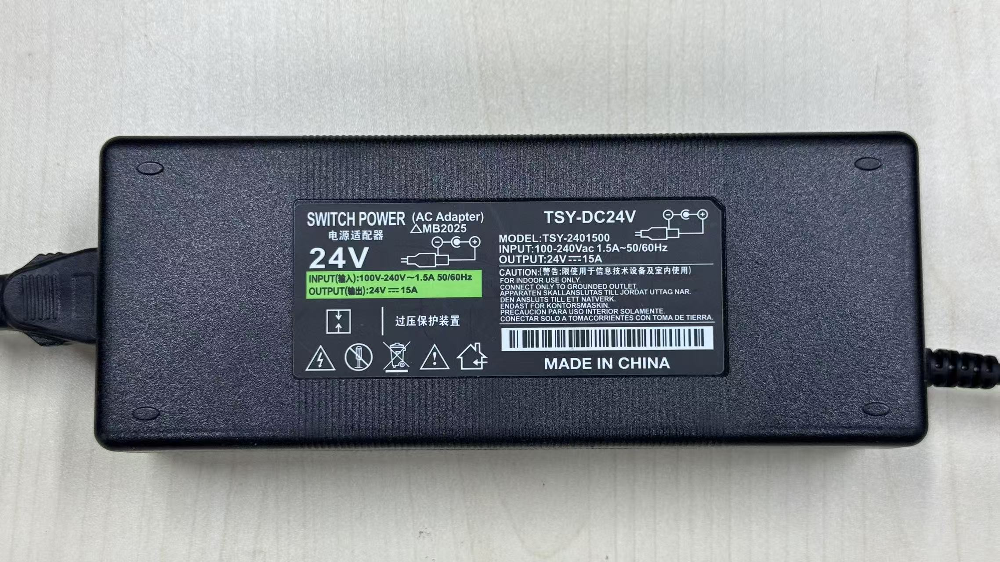
</div>

### 软件环境

1. 克隆 SDK 仓库：
```bash
git clone https://github.com/HighTorque-Robotics/Panthera-HT_SDK.git
cd Panthera-HT_SDK
```

2. 安装依赖并运行示例程序（详见 SDK 仓库的 README）。

### 第一个示例

参考 [Panthera-HT_SDK](https://github.com/HighTorque-Robotics/Panthera-HT_SDK) 中的示例代码，快速上手机械臂控制。

## 🤝 社区贡献

这个项目属于每一个热爱机器人的人！

### 完全开放

- ✅ **电机选择**：可以更换为其他品牌的关节模组
- ✅ **结构修改**：可以根据需求改变尺寸、材料、外观
- ✅ **算法优化**：欢迎提交更好的控制算法和功能
- ✅ **功能扩展**：添加视觉、力控、AI等新功能

### 我们需要你

项目在很多小细节上可能做得不够完善，我们需要社区的力量一起来完善：

- 📝 完善文档和教程
- 🐛 报告和修复bug
- 💡 提出新的功能建议
- 🔧 优化结构设计
- 📊 分享你的使用案例

欢迎提交 Issue 和 Pull Request！

## 🔗 相关文档与链接

- [Panthera-HT 官方网站](https://hightorque.cn/Panthera-HT_Hub/)
- [资料库](https://alidocs.dingtalk.com/i/nodes/ydxXB52LJq19j0OkUMNm3GO4JqjMp697)
- [参数表](images/参数.jpg)

**产品发布**：
- Panthera-HT 发布文章：https://mp.weixin.qq.com/s/Q9vUWf82evteEj3tVbXJsQ

**基础控制**：
- SDK配置与快速上手（视频教程）：https://www.bilibili.com/video/BV1SxwYzhEai/

**视觉与抓取**：
- GraspNet抓取位姿估计：https://www.bilibili.com/video/BV13KcDzLE3F/
- 视觉跟踪色块：https://www.bilibili.com/video/BV1JQPfz4EPN
- OpenClaw + 机械臂：https://www.bilibili.com/video/BV1e7QvBJERZ/

**遥操与数据采集**：
- 主从遥操打乒乓球：https://www.bilibili.com/video/BV1KprhBPE26/
- 移植LeRobot数据集进行模仿学习：https://www.bilibili.com/video/BV1GLi1BqETz/

**交流群**：
- QQ群：Panthera-HT交流群（1035440629）

**相关项目**：
- 夹爪设计参考：[UMI (Universal Manipulation Interface)](https://github.com/real-stanford/universal_manipulation_interface)

## 其他型号

### Panthera-HT_S 六轴机械臂

Panthera-HT_S 是 Panthera-HT 的 Mini 型号，在整体尺寸和性能上做了调整，但是夹爪尺寸是一样的。

<div align="center">
  
</div>

SDK仓库：https://github.com/HighTorque-Robotics/Panthera-HT_S_SDK

参数表：[Panthera-HT_S参数](images/S参数.jpg)

| 参数对比 | Panthera-HT | Panthera-HT_S |
| --- | ---: | ---: |
| 质量 | 4.35 kg | 3 kg |
| 臂展 | 860 mm | 641 mm |
| 折叠尺寸 | 460 mm | 410 mm |
| 最大负载 | 3.5 kg | 2.85 kg |
| 最大关节扭矩（峰值） | 36 Nm | 21 Nm |

## 🚀 未来规划

我们将持续完善当前能力，并继续扩展更多高级控制和具身智能方向的 Demo：

### 高级传统控制
- 点云避障
- 更多视觉伺服任务
- 更多传统控制算法
- 抓取成功率评估与实验流程标准化

### 具身智能方向
- Pi0、Pi0.5 等前沿算法集成
- RoboTWin2.0 适配
- 端到端学习
- 多模态感知与控制

## 👥 贡献者

<a href="https://github.com/wEch1ng">
  
</a>
<a href="https://github.com/chizhayuehaiyvyvmao">
  
</a>
<a href="https://github.com/tankail">
  
</a>

<!-- ## ⭐ Star History
<a href="https://www.star-history.com/?repos=HighTorque-Robotics%2FPanthera-HT_Main&type=date&legend=top-left">
 <picture>
   <source media="(prefers-color-scheme: dark)" srcset="https://api.star-history.com/image?repos=HighTorque-Robotics/Panthera-HT_Main&type=date&theme=dark&legend=top-left" />
   <source media="(prefers-color-scheme: light)" srcset="https://api.star-history.com/image?repos=HighTorque-Robotics/Panthera-HT_Main&type=date&legend=top-left" />
   
 </picture>
</a> -->

## ⚠️ 免责声明

> [!NOTE]
> 如果您基于此仓库构建或开发 Panthera-HT，您将对其对您或他人造成的所有身体和精神损害承担全部责任。

---

<a id="english"></a>

# Panthera-HT 🐆

[](#中文)[](#english)

An open-source six-axis robotic arm platform for students, makers, education and robot learning development.

> Official Website: [Panthera-HT Hub](https://hightorque.cn/Panthera-HT_Hub/)

<div align="center">
  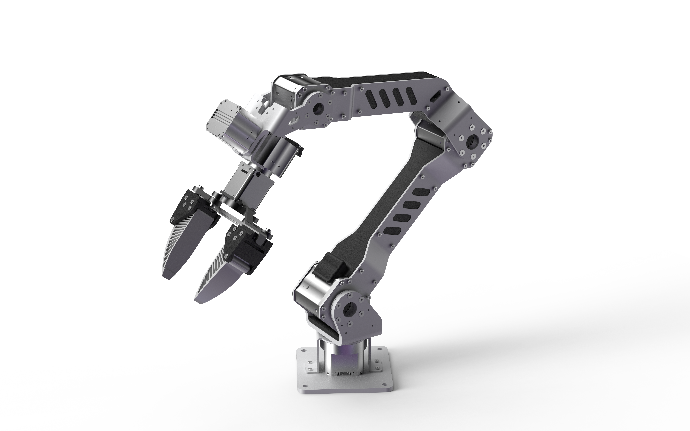
</div>

Panthera-HT is an open-source six-axis robotic arm that uses HighTorque planetary joint modules. It provides developers with a reusable unified control interface, serving as a standardized hardware and software experimental platform for algorithm verification, course experiments, system integration, embodied AI data collection, and secondary development.

The current control methods include C++, Python, and ROS2, with features including position/velocity/torque control, impedance control, gravity compensation mode, gravity-friction compensation mode, master-slave teleoperation, drag teaching, and more. It also supports data collection and inference under the LeRobot framework. Recent development demos include visual servoing, GraspNet grasp pose estimation, and color-block visual tracking. For more operation scripts, please refer to the SDK documentation.

## ✨ Project Origin and Mission

The mission of this project is to **enable students to access high-performance joint motor robotic arms at a lower cost**.

The project originally stems from the open-source work of [Ragtime-LAB/Ragtime_Panthera](https://github.com/Ragtime-LAB/Ragtime_Panthera), which we have refined and optimized. Thanks to the original author [wEch1ng (芝士榴莲肥牛)](https://github.com/wEch1ng) for their selfless sharing and open-source spirit!

To help students learn **how to build and control a robotic arm from scratch (0 to 1)**, we have open-sourced everything from structural design to control algorithms, allowing everyone to deeply understand how robotic arms work.

Later, the original project author and HighTorque hit it off, and with HighTorque's support, the project was refined and brought to market as a more complete maker product. However, we always adhere to the open-source philosophy and impose no restrictions on the project.

## 💡 Design Philosophy

### Low Cost + High Performance

- **Sheet Metal Frame**: High cost-performance sheet metal as the main frame, ensuring strength while reducing costs
- **3D Printing + CNC Machining**: Combined with 3D printing and 3-axis CNC machining for flexible structural design
- **High-Performance Joint Modules**: Using HighTorque planetary joint modules, balancing cost and performance

### Fully Open Source + Scalable

- **Open Structure**: Provides SolidWorks original design files, sheet metal unfolding diagrams, and 3D printing STL files
- **Open Algorithms**: All code from low-level control to advanced algorithms is fully open source
- **Unrestricted Modification**: You can freely replace motors, modify structures, and change appearance according to your needs
- **Modular Design**: Facilitates secondary development and feature expansion

## 📷 Project Images

<div align="center">
  
  
  <br/>
  
  
  <br/>
  
  
</div>

## ⚙️ Control Examples

### Position and Speed Control:
<div align="center">
  
</div>

### Master-Slave Teleoperation:
<div align="center">
  
</div>

### Master-Slave Teleoperated Grasping:
<div align="center">
  
</div>

## 🧭 Capability Status

| Direction            | Supported                                              |
| -------------------- | ------------------------------------------------------ |
| Basic Control        | Position, velocity, torque, and impedance control      |
| Compensation Control | Gravity compensation and gravity-friction compensation |
| Teleoperation        | Dual-arm master-slave teleoperation and drag teaching  |
| Vision               | Visual servoing and color-block tracking               |
| Grasping             | GraspNet grasp pose estimation demo                    |
| Robot Learning       | LeRobot data collection and inference                  |
| ROS2 Ecosystem       | Drivers, control, and simulation support               |

## 🎯 Use Cases

- **University courses**: Kinematics, dynamics, motor control, communication protocols, ROS2, and robot perception teaching.
- **Robotics clubs and maker projects**: Lower the barrier to building, controlling, and demonstrating a robotic arm.
- **Theory-to-hardware practice**: Help students and makers understand mechanical design, control algorithms, and real hardware debugging workflows.
- **Hackathon development**: Quickly combine arm hardware, cameras, grippers, and algorithms under short development cycles.
- **Vision-based grasping research**: Visual servoing, GraspNet grasp pose estimation, color tracking, and point-cloud experiments.
- **Embodied AI data collection**: Collect imitation learning data with teleoperation, drag teaching, and LeRobot.
- **ROS2 control and simulation training**: Driver development, control pipelines, simulation, and system integration.

## 🗃️ Other Repositories

| Repository                                                                                      | License        | Description                                                                                                                                |
| ----------------------------------------------------------------------------------------------- | -------------- | ------------------------------------------------------------------------------------------------------------------------------------------ |
| **[Panthera-HT_SDK](https://github.com/HighTorque-Robotics/Panthera-HT_SDK)**                   | [MIT](LICENSE) | C++/Python SDK development package, providing quick-start example code and development toolchain.                                          |
| **[Panthera-HT_Host](https://github.com/HighTorque-Robotics/Panthera-HT_Host)**                 | [MIT](LICENSE) | Integration of Robotic Arm PC Web Visualization Control Platform with SDK Examples.                                                        |
| **[Panthera-HT_ROS2](https://github.com/HighTorque-Robotics/Panthera-HT-ROS2)**                 | [MIT](LICENSE) | ROS2 development package providing robotic arm drivers, control, and simulation support.                                                   |
| **[Panthera-HT_lerobot](https://github.com/HighTorque-Robotics/Panthera-HT_lerobot)**           | [MIT](LICENSE) | LeRobot integration package, supporting imitation learning and robot learning algorithms.                                                  |
| **[Panthera-HT_Extensions](https://github.com/HighTorque-Robotics/Panthera_HT_SDK_Extensions)** | [MIT](LICENSE) | A repository of development cases, including the implementation of processes such as D405 camera hand-eye calibration and visual servoing. |
| **[Panthera-HT_Model](https://github.com/HighTorque-Robotics/Panthera-HT_Model)**               | [MIT](LICENSE) | SolidWorks original design files, sheet metal unfolding diagrams, 3D printing files, and Bill of Materials (BOM).                          |

## 🚀 Quick Start

### Unboxing and Setup

Follow the [Quick Start Guide](./documents/Panthera-HT_Quick_Start_Guide_A5.pdf) to assemble the robotic arm, and consult the [Parameter Manual](./documents/Panthera-HT_Parameter_Manual_A5.pdf) for its basic specifications.

### Hardware Preparation (Optional for Self-Assembly)

1. Check the [Panthera-HT_Model](https://github.com/HighTorque-Robotics/Panthera-HT_Model) repository to review the complete Bill of Materials (BOM).
2. Prepare files for sheet metal processing, 3D printing, and CNC machining.
3. Purchase HighTorque joint modules and other electronic components.
4. Regarding the selection of power supply devices, we recommend using an adjustable power supply to provide stable 24V 15A power to the device.

- Sets purchased through our sales channels will include a 220V to 24V 15A power adapter (three-prong plug). If the power supply voltage in your region is 220V, you can directly use this adapter.
<div align="center">
  
</div>

### Software Environment

1. Clone the SDK repository:
```bash
git clone https://github.com/HighTorque-Robotics/Panthera-HT_SDK.git
cd Panthera-HT_SDK
```

2. Install dependencies and run example programs (see SDK repository README for details).

### First Example

Refer to the example code in [Panthera-HT_SDK](https://github.com/HighTorque-Robotics/Panthera-HT_SDK) to quickly get started with robotic arm control.

## 🤝 Community Contribution

This project belongs to everyone who loves robotics!

### Fully Open

- ✅ **Motor Selection**: Can be replaced with joint modules from other brands
- ✅ **Structural Modification**: Can change size, materials, and appearance according to needs
- ✅ **Algorithm Optimization**: Welcome to submit better control algorithms and features
- ✅ **Feature Extension**: Add new features like vision, force control, AI, etc.

### We Need You

The project may not be perfect in many small details, and we need the community's help to improve it together:

- 📝 Improve documentation and tutorials
- 🐛 Report and fix bugs
- 💡 Propose new feature suggestions
- 🔧 Optimize structural design
- 📊 Share your use cases

Welcome to submit Issues and Pull Requests!

## 🔗 Related Documents and Links

- [Panthera-HT Official Website](https://hightorque.cn/Panthera-HT_Hub/)
- [Resource Library](https://alidocs.dingtalk.com/i/nodes/ydxXB52LJq19j0OkUMNm3GO4JqjMp697)
- [Parameter](images/parameter.jpg)

**Product Launch**:
- Panthera-HT launch article: https://mp.weixin.qq.com/s/Q9vUWf82evteEj3tVbXJsQ

**Basic Control**:
- SDK setup and quick start (video tutorial): https://www.bilibili.com/video/BV1SxwYzhEai/

**Vision and Grasping**:
- GraspNet grasp pose estimation: https://www.bilibili.com/video/BV13KcDzLE3F/
- Color-block visual tracking: https://www.bilibili.com/video/BV1JQPfz4EPN/
- OpenClaw + robotic arm: https://www.bilibili.com/video/BV1e7QvBJERZ/

**Teleoperation and Data Collection**:
- Master-slave teleoperation playing table tennis: https://www.bilibili.com/video/BV1KprhBPE26/
- Porting LeRobot dataset for imitation learning: https://www.bilibili.com/video/BV1GLi1BqETz/

**Community**:
- QQ Group: Panthera-HT Community (1035440629)

**Related Projects**:
- Gripper Design Reference: [UMI (Universal Manipulation Interface)](https://github.com/real-stanford/universal_manipulation_interface)

## Other Models

### Panthera-HT_S 6-DOF Robotic Arm

Panthera-HT_S is the Mini model of Panthera-HT, with adjustments made to overall size and performance, but the gripper size remains the same.

<div align="center">
  
</div>

SDK repository: https://github.com/HighTorque-Robotics/Panthera-HT_S_SDK

| Parameter comparison | Panthera-HT | Panthera-HT_S |
| --- | ---: | ---: |
| Mass | 4.35 kg | 3 kg |
| Arm span | 860 mm | 641 mm |
| Folded dimensions | 460 mm | 410 mm |
| Maximum payload | 3.5 kg | 2.85 kg |
| Maximum joint torque (peak) | 36 Nm | 21 Nm |

## 🚀 Future Roadmap

We will continue improving the current capabilities and expanding more demos for advanced control and embodied intelligence:

### Advanced Traditional Control
- Point-cloud obstacle avoidance
- More visual servoing tasks
- More traditional control algorithms
- Grasp success evaluation and standardized experiment workflows

### Embodied Intelligence
- Integration of cutting-edge algorithms like Pi0, Pi0.5
- RoboTWin2.0 adaptation
- End-to-end learning
- Multimodal perception and control

## 👥 Contributors

<a href="https://github.com/wEch1ng">
  
</a>
<a href="https://github.com/chizhayuehaiyvyvmao">
  
</a>
<a href="https://github.com/tankail">
  
</a>

<!-- ## ⭐ Star History
<a href="https://www.star-history.com/?repos=HighTorque-Robotics%2FPanthera-HT_Main&type=date&legend=top-left">
 <picture>
   <source media="(prefers-color-scheme: dark)" srcset="https://api.star-history.com/image?repos=HighTorque-Robotics/Panthera-HT_Main&type=date&theme=dark&legend=top-left" />
   <source media="(prefers-color-scheme: light)" srcset="https://api.star-history.com/image?repos=HighTorque-Robotics/Panthera-HT_Main&type=date&legend=top-left" />
   
 </picture>
</a> -->

## ⚠️ Disclaimer

> [!NOTE]
> If you build or develop Panthera-HT based on this repository, you will be fully responsible for all physical and mental damages caused to you or others.
