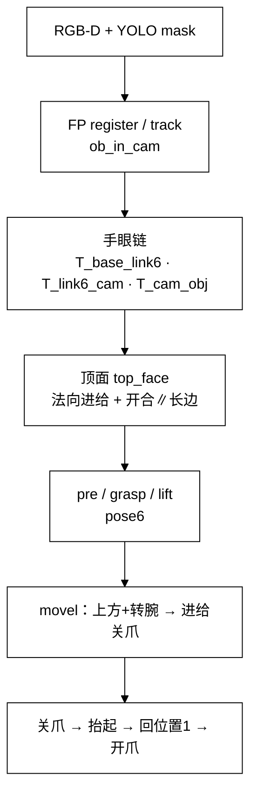
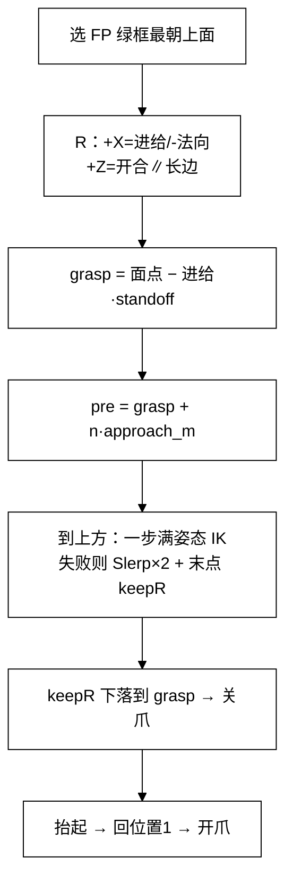

# Panthera-HT × FoundationPose 抓取：问题、过程与解决办法

> 面向：把瑞尔曼侧已跑通的 FP 抓取迁到本机高擎（Panthera-HT）时的实战记录。  
> 日期：2026-08-21  
> 相关代码：`Panthera-HT_SDK/.../foundationpose_grasp/`、`third_party/FoundationPose/`

---

## 1. 目标与约束

| 项 | 内容 |
|----|------|
| 目标流程 | 位置1 → YOLO → FP 注册/跟踪 → 抓取抬起 → 回位置1 → 开爪 |
| 参考实现 | 瑞尔曼冻结帧支线：`movel(pre)` → `movel(grasp)` → 关爪 → `movel(lift)` |
| 硬件 | 腕部 D435i（眼在手上）；TCP=`tool_link`（相对 link6 沿 +X≈0.165m） |
| 进给 / 开合 | `approach_axis: x`（tool +X 进给）；开合为 tool +Z（∥顶面长边 → 夹短边） |
| 约束 | 少改无关代码；串口与 Host `app.py` **互斥**；感知/臂分属不同 Python 环境 |

**一键启动（先停 Host，并确认无残留 `arm_daemon`）：**

```bash
# 若提示 ttyACM0 被占，先查再杀
fuser -v /dev/ttyACM0
pkill -f arm_daemon.py   # 常见是上次抓取残留，不是 Host

bash third_party/FoundationPose/run_panthera_grasp.sh
```

- 感知：`~/miniconda3/envs/internnav`
- 臂/守护：`~/venvs/panthera`
- 操作：第 1 次空格 = YOLO 确认 + FP 注册；第 2 次空格 = 冻结帧抓取

---

## 2. 整体架构（≤7 节点）

```mermaid
%%{init: {'theme':'base','themeVariables':{'primaryColor':'#ffffff','primaryTextColor':'#000000','primaryBorderColor':'#000000','lineColor':'#000000','secondaryColor':'#ffffff','tertiaryColor':'#ffffff','background':'#ffffff','fontFamily':'sans-serif'}}}%%
flowchart LR
  A["相机 D435i"] --> B["YOLO + FoundationPose"]
  B --> C["pose JSON 冻结帧"]
  C --> D["arm_daemon<br/>127.0.0.1:9877"]
  D --> E["grasp_pipeline<br/>规划 pre/grasp/lift"]
  E --> F["panthera_client<br/>MIT 运动 + 夹爪"]
  F --> G["机械臂 / 夹爪"]
  style A fill:#fff,stroke:#000,color:#000
  style B fill:#fff,stroke:#000,color:#000
  style C fill:#fff,stroke:#000,color:#000
  style D fill:#fff,stroke:#000,color:#000
  style E fill:#fff,stroke:#000,color:#000
  style F fill:#fff,stroke:#000,color:#000
  style G fill:#fff,stroke:#000,color:#000
```



**说明：** 感知进程负责检测与位姿；抓取由同机 `arm_daemon` 同进程执行（无泻力交接），避免与 Host 抢串口。

---

## 3. 数据流（≤7 节点）



**说明：** 抓取默认 **冻结空格帧**（`live_track: false`）；抓取进行中暂停 FP 跟踪/跟丢找回，避免眼在手上相机一动就误报跟丢。

---

## 4. 核心抓取算法（单独）



**说明：** `standoff`（现多为负值）决定关爪深浅；远点末点 keepR 能保证继续下落，但可能残留 tip 对齐偏差（约 16°）。

**关爪高度公式（高擎）：**

- `standoff ≈ flange_above_top_m`（优先于 `tcp_to_pad_m`）
- **正值**：TCP 停在顶面外侧（上方）
- **负值**：越过顶面下探（侧向夹短边更稳）
- 当前配置：`flange_above_top_m: -0.022`（约下探 22mm）

瑞尔曼侧 `flange_above` 常为 **+0.2m**，因其 TCP 在法兰而非指尖；**不可照搬数值**。

---

## 5. 问题 → 过程 → 解决办法

### 5.1 串口被占，无法回位置1 / 抓取

| | |
|--|--|
| **现象** | `run_panthera_grasp.sh` 警告 `/dev/ttyACM0` 被占；脚本文案常写 Host，但实际也可能是旧守护 |
| **过程** | `fuser -v /dev/ttyACM0` → 查 PID → `ps -fp <pid>` |
| **解决** | 停 Host `app.py`；或 `pkill -f arm_daemon.py` 清上次残留后再启动 |

### 5.2 远点满 6D IK 失败（`movel … ret=-2`）

| | |
|--|--|
| **现象** | 物体基座系常 **y≈0.48–0.53m**；日志 `上方+转腕 failed` / tip 未到位就中断 |
| **过程** | 试过多种自创顺序（先转腕再平移、观察姿到上方、腕网格等），易出现斜伸、停在观察位、XY 漂约 9cm |
| **解决** | 对齐瑞尔曼语义：**目标是完整 pose6**；一步不可解则 **Slerp 逼近×2 + 末点 keepR 钉上方 XYZ**，再 keepR 进给关爪；`approach_m` 约 **0.08m** |
| **现状** | 能抓通，但末点 keepR 常残留 **tip 对齐进给 ≈16°**（已知姿态偏差，见 5.5） |

### 5.3 进爪太浅（抓尖贴物体表面）

| | |
|--|--|
| **现象** | 关爪时尖端几乎贴顶面，夹不住侧壁 |
| **过程** | 日志：面点 z≈66mm，外退仅 +10mm → 关爪 z≈77mm；实测甚至更贴面 |
| **解决** | `flange_above_top_m` / `tcp_to_pad_m` 改为 **-0.022**（下探约 22mm）；过深改 `-0.015`，仍浅改 `-0.030` |

### 5.4 流程结束未开爪

| | |
|--|--|
| **现象** | 抬起回位置1后夹爪仍闭合 |
| **解决** | `grasp_pipeline`：回位置1后调用 `gripper_open()` |

### 5.5 转腕后相对物体朝向偏（不能偏）

| | |
|--|--|
| **现象** | 日志 `tip对齐进给≈16.5°`；肉眼可见爪姿与物体朝向不一致 |
| **根因** | 远点满姿态失败 → 末点 **keepR** 只保位置，腕姿未拧到规划 `R_tgt` |
| **曾议方案** | 到位后再求满姿态 IK / 腕网格精修 + tip>5° 硬失败 |
| **现状** | **尚未落地硬门槛**；连续单轨迹改法已试过后按需求 **回退** |

### 5.6 「三段式发力」观感

| | |
|--|--|
| **现象** | 到上方过程像发了三次力 |
| **根因** | Slerp **路点1停 → 路点2停 → 末点 keepR**，各带一次 `stream_move` + hold |
| **曾改** | 多结点离线规划 + **一条连续 MIT 轨迹** |
| **回退** | 用户要求保持原分段行为；磁盘已恢复三段 Slerp；**改代码后必须重启守护**，否则仍跑内存里旧逻辑 |

### 5.7 抓取中误报跟丢 / 错加载类别

| | |
|--|--|
| **现象** | 臂一动（眼在手上）FP 跟丢，甚至误切 Charger |
| **解决** | 抓取进行中暂停 FP 跟踪与跟丢找回；用冻结帧驱动臂 |

### 5.8 改参不生效

| | |
|--|--|
| **原因** | `arm_daemon` 长驻，Python 模块已 import |
| **解决** | Ctrl+C 停脚本 → 确认无 `arm_daemon` → 再 `run_panthera_grasp.sh`；日志应出现 `Slerp 逼近×2` 而非「连续轨迹」 |

---

## 6. 关键文件与配置

| 路径 | 作用 |
|------|------|
| `third_party/FoundationPose/run_panthera_grasp.sh` | 一键启动 |
| `.../foundationpose_grasp/arm_daemon.py` | 串口保位 + 同进程抓取 TCP:9877 |
| `.../grasp/grasp_pipeline.py` | 冻结规划与动作顺序 |
| `.../panthera_client.py` | IK / Slerp / MIT 运动 / 夹爪 |
| `.../grasp/coord_utils.py` | 顶面、进给、standoff、路点 |
| `.../config/hardware_panthera.yaml` | 关节初值、手眼、抓深、approach |
| `hands/config/hardware_panthera.yaml` | FP 启动读的硬件配置（需与上者关键项同步） |

**常调参数（抓深 / 接近）：**

```yaml
# hardware_panthera.yaml → arm.fp_grasp / gripper
flange_above_top_m: -0.022   # 负=下探；优先于 tcp_to_pad_m
tcp_to_pad_m: -0.022
approach_m: 0.08             # pre 相对 grasp 的外退距离
lift_m: 0.10
```

**日志快速判读：**

- `上方到位(末点 keepR): … tip对齐进给=xxdeg` → xx 大则爪姿偏
- `关爪高度: 面点 … + 进给外退(±mm)` → 外退符号与深浅
- `movel … failed ret=-2` → IK/轨迹失败，先查距离与是否残留旧守护

---

## 7. 推荐操作清单

1. 停 Host；`fuser /dev/ttyACM0` 空闲（无 `arm_daemon` / `app.py`）
2. 物体尽量靠近底座（水平约 **0.35–0.45m**），减轻远点 IK
3. `bash third_party/FoundationPose/run_panthera_grasp.sh`
4. 空格注册 → 绿框稳定再空格抓
5. 改 yaml / `panthera_client` 后 **必须重启整条链路**

---

## 8. 遗留与下一步

1. **姿态硬对齐**：上方到位后二次满姿态 / 腕网格，tip 与开合轴超阈值失败，避免斜抓  
2. **运动观感**：若再要「一气呵成到上方」，需在分段与连续轨迹间明确选型并强制热重启验证  
3. **Skill01 放货**：当前高擎脚本多为抓抬回位开爪；完整「回位置1找筐放货」仍以瑞尔曼/Skill01 为参考，未完全迁完  
4. **工作空间**：远点 y>0.5m 仍是 IK 主瓶颈，优先靠摆放缓解  

---

## 9. 与其它文档关系

- 架构缺口总览：`docs/Panthera-HT-架构现状与缺口.md`
- 手眼标定过程：`docs/Panthera-HT-手眼标定与点击工作总结.md`
- 包内用法说明：`Panthera-HT_SDK/.../foundationpose_grasp/README.md`
