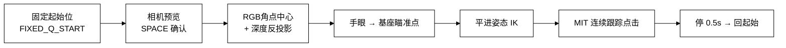
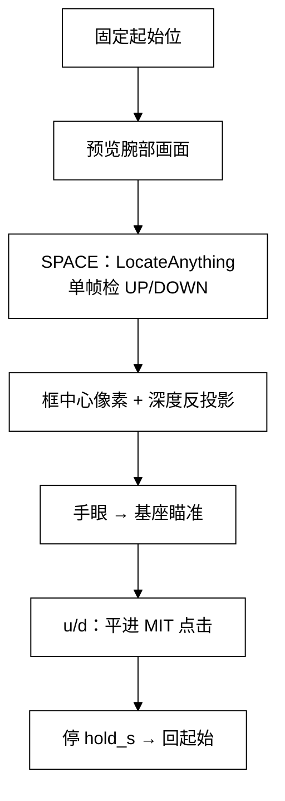
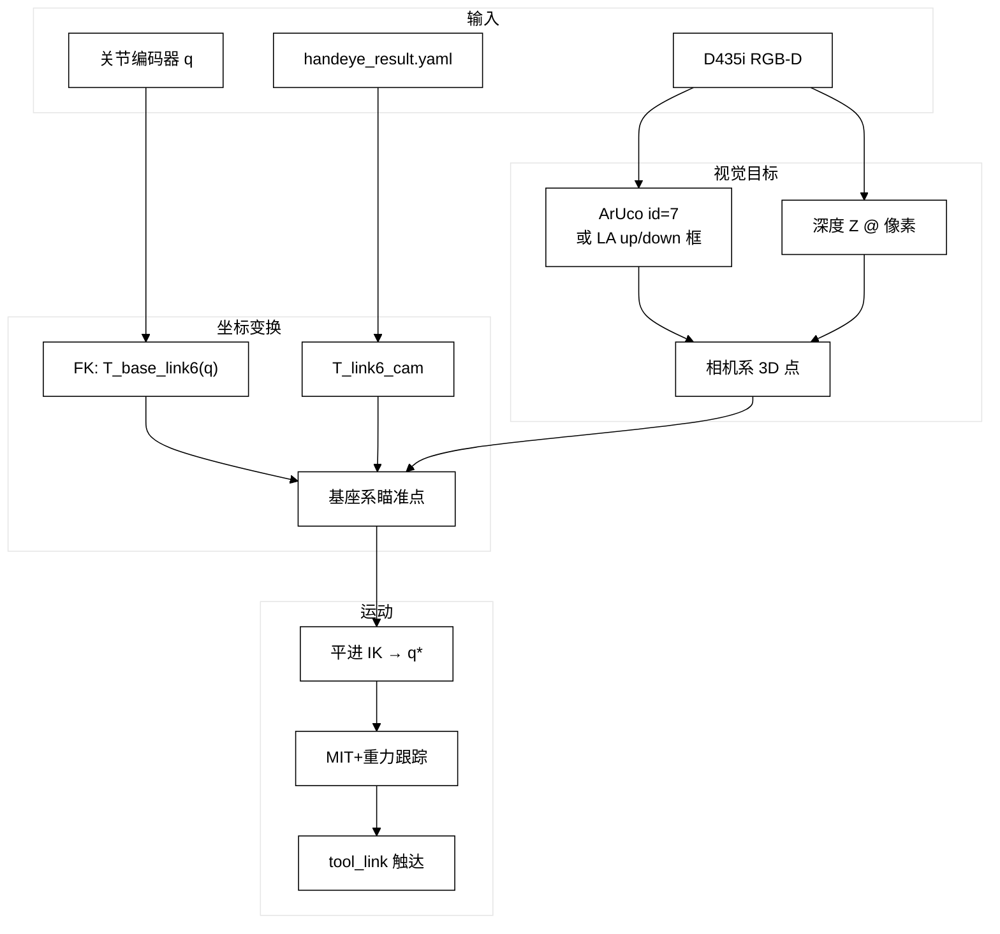

# Panthera-HT 腕部手眼标定与点击工作总结

> 时间跨度：2026-08-17 ～ 2026-08-19  
> 硬件：Panthera-HT 六轴臂 + 腕部 Intel RealSense D435i + 16×16 cm ArUco 标定板（id=7）  
> 目标：完成眼在手上标定 → 验证点击标定板中心 → 扩展到电梯厅外 UP/DOWN 按键识别与点击

---

## 1. 工作概览

本阶段从「设备连通」做到「视觉引导点击」，形成一条可复用链路：

```text
腕部 RGB-D 检测目标像素
  → 深度反投影得到相机系 3D
  → 手眼外参 T_link6_cam 变到基座系
  → 平进姿态 IK
  → MIT+重力连续跟踪到位点击
  → 回固定起始位
```

| 阶段 | 产出 | 状态 |
|------|------|------|
| 系统架构梳理 | `docs/Panthera-HT-架构现状与缺口.md/.docx` | ✅ |
| 设备连通（臂+D435i） | USB 串口 + RealSense 取流验证 | ✅ |
| 自动手眼标定 | `8_handeye_d435i_calib.py` + 配置 YAML | ✅ 可用，现场改用手采 |
| 手动重力示教标定 | `9_handeye_manual_calib.py` | ✅ 主用 |
| 标定板中心点击 | `10_handeye_touch_test.py` | ✅ 可用 |
| 电梯 UP/DOWN 点击 | `11_elevator_updown_click.py` + LocationAnything | ✅ 可用，侧移鲁棒性待加强 |

---

## 2. 系统与环境要点

### 2.1 串口独占

标定 / 点击脚本与 Host 数字孪生后端 **不能同时开**：

- Host：`Panthera_digital_twin-main/backend/app.py` 占用 `/dev/ttyACM*`
- 脚本再开会检出 0 电机，表现为 `max_torque` 长度不匹配等假报错

**操作原则：** 跑脚本前先停 `app.py`，确认 `fuser /dev/ttyACM0` 无输出。

### 2.2 坐标系约定

| 名称 | 含义 |
|------|------|
| `link6` | 法兰（手眼外参附着点） |
| `tool_link` | 夹爪 TCP（相对法兰沿 X 约 +165 mm） |
| `T_gripper_cam` / `T_link6_cam` | 相机相对法兰的固定外参 |
| 眼在手上关系 | \( {}^{base}T_{cam} = {}^{base}T_{link6}(q) \cdot {}^{link6}T_{cam} \) |

点击目标一律用 **`tool_link` 尖端**；手眼求解用 **`link6`**。

### 2.3 标定板

- 类型：单块大 ArUco（非 8×8 棋盘）
- 字典：`DICT_6X6_50`，**id=7**
- 边长：黑色外框 **0.16 m**（白边不算）
- 相机：D435i，序列号 `347622074620`，彩色 1280×720

---

## 3. 手眼标定

### 3.1 设计方案

**类型：** eye-in-hand（相机装在腕部）  
**算法：** OpenCV `calibrateHandEye`（Park / Tsai 等），\(AX=XB\)  
**关键点：** 不需要知道板在基座下的绝对坐标；板固定，多姿态采集 \(T_{base}^{gripper}\) 与 \(T_{cam}^{board}\) 即可。

配置文件：`Panthera-HT_SDK/panthera_python/scripts/handeye_d435i_config.yaml`

主要参数：

| 项 | 值 |
|----|-----|
| 求解方法 | Park（当前默认） |
| 最少样本 | 15 |
| 目标 RMS | ≤ 5 mm |
| RANSAC 内点 | 10 mm |
| 检测 | 多帧平均、深度尺度修正、边框/重投影剔除 |

### 3.2 自动标定（脚本 8）与改动手采的原因

自动流程曾做两阶段：

1. Stage1：关节小扰动粗采  
2. Stage2：更大关节增量 + 相机方向小步靠近（早期「绕板绝对轨道 IK」因粗外参误差易飞出工作空间，已废弃）

现场问题：幅度偏小、Stage2 IK 刷屏失败、D435i USB 掉线等。最终改用 **人工摆姿**。

### 3.3 手动标定（脚本 9）— 当前主流程

文件：`9_handeye_manual_calib.py`

| 按键 | 作用 |
|------|------|
| SPACE | 停稳后采 1 组（须检测合格） |
| BACKSPACE | 撤销上一组 |
| ENTER | ≥8 组可提前求解 |
| Q / ESC | 退出（请先扶住手臂） |

**重力补偿示教：** 上电默认位置锁定，无法徒手拖动。程序持续发送 `kp=0` + 重力/摩擦补偿 + 小阻尼，即可慢慢拖臂采样。

运行：

```bash
source ~/venvs/panthera/bin/activate
cd ~/桌面/Panthera-HT/Panthera-HT_SDK/panthera_python/scripts
# 先停 app.py
python3 9_handeye_manual_calib.py
```

### 3.4 标定结果数据（关键两版）

#### A. 2026-08-18 手动标定（Tsai）

路径：`handeye_output/manual_20260818_152904/handeye_result.yaml`

| 项 | 值 |
|----|-----|
| 方法 | Tsai |
| 样本数 | 15 |
| 板位 RMS | **6.91 mm** |
| 板位 MAX | 9.42 mm |
| 平移 t (m) | [0.0533, 0.0226, 0.0514] |
| 目标 ≤5 mm | 未通过 |

#### B. 2026-08-19 手动标定（Park）— **当前默认**

路径：`handeye_output/manual_20260819_150758/handeye_result.yaml`

| 项 | 值 |
|----|-----|
| 方法 | Park |
| 样本数 | 15 |
| 板位 RMS | **5.93 mm** |
| 板位 MAX | 12.60 mm（个别姿态较差） |
| 平移 t (m) | [0.0540, 0.0335, 0.0556] |
| 四元数 wxyz | [0.502, -0.513, 0.478, -0.507] |
| 目标 ≤5 mm | 未通过（接近） |

**外参矩阵 \(T_{link6}^{cam}\)（当前默认）：**

```text
[[ 0.0290,  0.0174,  0.9994,  0.0540],
 [-0.9988, -0.0391,  0.0297,  0.0335],
 [ 0.0396, -0.9991,  0.0163,  0.0556],
 [ 0.0000,  0.0000,  0.0000,  1.0000]]
```

**两版对比：** 平移差约 1.2 cm（主要 Y 向 +1.1 cm）。RMS 略好，但都不能把「点击厘米级偏差」全部吃掉；剩余误差来自竖直约束弱、MIT 下垂、检测中心定义等。

### 3.5 依赖说明

- OpenCV 5 移除了手眼 API → 使用 **opencv-contrib-python 4.10**
- 需 `pyrealsense2`
- Python 环境：`~/venvs/panthera`

---

## 4. 点击设计（标定板中心）

文件：`10_handeye_touch_test.py`

### 4.1 最终流程（精简版）



**说明（≤100字）：** 先到固定观察位，用深度反投影板心，再以夹爪平进姿态一次到位；全程 MIT+重力，避免 moveJ 空窗塌腕。

### 4.2 几何定义

| 量 | 定义 |
|----|------|
| 板心 | ArUco 四角像素均值 + RealSense 深度 → 内参反投影 → `T_base_cam` |
| 法向 | 优先四角深度平面拟合；失败退回 ArUco PnP |
| 平进姿态 | tip `+X` 穿墙（−法向）；tip `+Z` 沿板面向上 |
| 瞄准点 | `p_center = p_depth + up * up_m` |
| 停靠点 | `target = p_aim + n * standoff`（`n` 朝外） |

### 4.3 当前默认参数

| 参数 | 默认值 | 含义 |
|------|--------|------|
| `FIXED_Q_START` | `[-0.001, 0, 0.355, -0.199, 0.037, 0]` rad | 每次启动先到此位 |
| `--up_m` | **0.025 m（2.5 cm）** | 沿板面上抬，补偿手眼竖直偏差+塌腕 |
| `--standoff` | **0.005 m** | 停在板外 5 mm（轻触，避免压坏板） |
| `--hold_s` | 0.5 s | 点到位后停留再回退 |
| 标定文件 | `manual_20260819_150758` | 默认外参 |

MIT 保持刚度（减轻塌腕）：

```text
HOLD_KP = [45, 80, 90, 40, 30, 22]
HOLD_KD = [4, 6, 7, 3.5, 2.5, 1.8]
```

### 4.4 迭代中踩过的坑（设计决策来源）

| 现象 | 根因 | 最终对策 |
|------|------|----------|
| 串口报错 / 0 电机 | Host 占串口 | 跑前停 `app.py` |
| 触碰偏差「软件 1 cm、肉眼 6–9 cm」 | 桌面臂+墙板，竖直约束弱；TCP/观测定义易混 | 深度直接点 + `up_m` 补偿 |
| 流程过慢、反复等待 | 多档靠近 + 反复补 IK + 过大 `up_m` | 改为「一次平进到位」 |
| joint4 几乎不动、斜着够 | IK 死保起始翘头姿态 | 强制平进姿态 + joint4 扰动种子 |
| 到位突然掉 2 cm | `moveJ` 发完空等，腕部失力 | `stream_move_mit` 全程 MIT+重力 |
| 深度「有没有用」争议 | 早期只用深度缩放 PnP | 改为 **像素+深度反投影** 直接算点击点 |
| `up_m=4 cm` 过冲偏高 | 4 cm 里含约 1.4 cm 运动塌腕 | 默认改为 **2.5 cm** |

### 4.5 运行命令

```bash
source ~/venvs/panthera/bin/activate
cd ~/桌面/Panthera-HT/Panthera-HT_SDK/panthera_python/scripts
python3 10_handeye_touch_test.py
# 微调示例：
# python3 10_handeye_touch_test.py --up_m 0.02 --standoff 0.005
```

操作：到起始 → 预览看到 id=7 → **SPACE** → 平进点击 → 自动回起始。

**实测结论：** 标定板中心即使挪位置，点击偏差通常不大（厘米内可调）；说明手眼 + 深度反投影链路在「清晰大目标」上可用。

---

## 5. 电梯 UP/DOWN 点击设计

文件：`11_elevator_updown_click.py`  
检测：`elevator_detect.py` + `locateanything_ipc.py`  
模型：`third_party/LocationAnything/`（权重符号链接到本机 LocateAnything-3B）

### 5.1 设计思路

与标定板点击 **同一套运动学**，仅把目标从「ArUco 板心」换成「厅外 UP/DOWN 按钮中心」：



**说明（≤100字）：** VLM 给出按键框，深度定 3D 点，复用平进点击；SPACE 冻结该帧 RGBD，避免换帧深度漂。

### 5.2 交互设计

| 按键 | 作用 |
|------|------|
| SPACE | 调用 LocateAnything 检测（尽量 1 s 内；冷启动更慢） |
| `u` / `d` | 点击上/下键 |
| ESC / q | 退出并回起始 |

### 5.3 检测后处理设计

- 提示词强调 **厅外三角 call 按钮**
- **竖排先验：** 最上=UP、次之=DOWN；更低框当钥匙孔丢弃
- 同标签多框取**最上**，不取最大面积（避免钥匙孔/反光大框）
- 曾因侧视+金属反光出现「只检出 up、漏 down」

### 5.4 当前默认参数（电梯专用）

| 参数 | 默认 | 说明 |
|------|------|------|
| 起始位 | 与触摸相同 `[-0.001, 0, 0.355, -0.199, 0.037, 0]` | 曾用「位置1」`[0, 0.79, 1.11, -0.30, 0.03, 0]`，偏差更大后改回 |
| `--up_m` | **0.012 m** | 补 MIT 下垂（日志常见到位 Z 低 5–9 mm）；**不要**再沿用标定板的 2.5 cm |
| `--standoff` | **-0.004 m** | 往板内过冲约 4 mm，把键按实 |
| `--hold_s` | **0.8 s** | 按压保持 |
| `--off_y` | 0 | 基座 Y 固定偏置，侧偏时可微调 |
| 标定 | `manual_20260819_150758` | 与触摸共用 |

运行：

```bash
source ~/venvs/panthera/bin/activate
cd ~/桌面/Panthera-HT/Panthera-HT_SDK/panthera_python/scripts
./run_elevator_updown.sh
# 或：
# python3 11_elevator_updown_click.py --up_m 0.015 --off_y 0.005
```

### 5.5 电梯 vs 标定板：为何偏差差很多

| | 标定板点击 | 电梯按键 |
|--|------------|----------|
| 目标中心 | ArUco 角点亚像素 + 深度，几何清晰 | VLM 框中心，抖动/漏检/反光敏感 |
| 深度质量 | 纸板纹理相对友好 | 金属面板深度噪声大 |
| 目标尺寸 | 16 cm 大板 | 小圆钮，杠杆放大误差 |
| `up_m` 误用 | 2.5 cm 合理 | 若误用 2.5 cm 必然点偏（已改为 0～12 mm） |

**结论：** 手眼本身约 6 mm RMS；电梯侧不准更多来自 **检测框 + 金属深度 + 侧向姿态/IK**，不是「标定板能点、电梯就不能点」的矛盾。

### 5.6 侧向平移问题（已知）

面板左右平移后：

1. 检测可能漏键（VLM 侧视不稳定）  
2. 平进 IK 种子偏重 joint4，joint5 扰动曾试过又回退  
3. 人手拧 j5 能平行点中 → 工作空间够，是 **求解种子/策略** 问题  

后续可再增强 j5 多种子，或在侧偏时先做一个面向面板的预对准姿态。

---

## 6. 交付文件清单

| 路径 | 作用 |
|------|------|
| `scripts/8_handeye_d435i_calib.py` | 自动手眼标定核心（检测/求解/保存） |
| `scripts/9_handeye_manual_calib.py` | 重力示教手动采样标定 |
| `scripts/10_handeye_touch_test.py` | 标定板中心点击验证 |
| `scripts/11_elevator_updown_click.py` | 电梯 UP/DOWN 识别点击 |
| `scripts/handeye_d435i_config.yaml` | 标定与检测配置 |
| `scripts/handeye_output/manual_20260819_150758/` | **当前默认外参** |
| `scripts/elevator_detect.py` | UP/DOWN 检测与后处理 |
| `scripts/locateanything_ipc.py` | LocateAnything IPC（conda `locateanything`） |
| `scripts/run_elevator_updown.sh` | 一键启动电梯脚本 |
| `third_party/LocationAnything/` | 模型与推理代码（权重软链） |
| `docs/Panthera-HT-架构现状与缺口.md` | 系统整体/现状/缺口 |
| `docs/Panthera-HT-手眼标定与点击工作总结.md` | 本文档 |

---

## 7. 数据流总图



**说明（≤100字）：** RGB 定像素、深度定距离、外参与 FK 定基座目标，最后用平进 IK + MIT 把 TCP 送到按键/板心。

---

## 8. 遗留问题与建议下一步

1. **标定 RMS 仍 >5 mm**  
   增加姿态多样性（尤其俯仰/绕竖直轴），严格量准黑框边长；必要时换棋盘/多码板提高竖直约束。

2. **电梯侧移鲁棒性**  
   - 漏检：缺键自动二次推理 / 放宽 crop  
   - 点偏：恢复并验证 joint5 多种子 IK；或侧偏时先预对准  
   - 深度：对金属钮做中值滤波窗口调参

3. **楼层面板**  
   当前只做厅外 UP/DOWN；楼层数字可继续用 LocateAnything 提示词扩展，运动链路可复用 `11`。

4. **工程化**  
   - 统一 `up_m` / `standoff` 按任务配置，避免交叉污染  
   - 脚本与 Host 串口仲裁（或脚本内检测并提示）  
   - 将手眼结果纳入配置管理，避免多份 yaml 混用

---

## 9. 一页纸结论

- **已打通：** 腕部 D435i 眼在手上标定 → 深度反投影 → 平进 MIT 点击。  
- **当前外参：** `manual_20260819_150758`，Park，板位 RMS ≈ **5.9 mm**。  
- **标定板点击：** 可用；默认上抬 2.5 cm、板外 5 mm、固定起始位。  
- **电梯 UP/DOWN：** 可用；默认上抬 12 mm、过冲 −4 mm；侧移与漏检仍是主要短板。  
- **运维铁律：** 跑真机脚本前必须停 Host `app.py`。

---

*文档整理日期：2026-08-20 · 基于 Cursor 对话与仓库脚本/标定产物*
