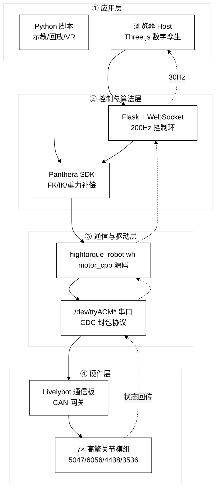
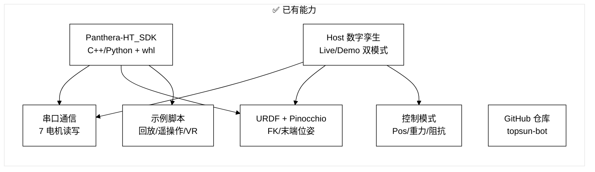
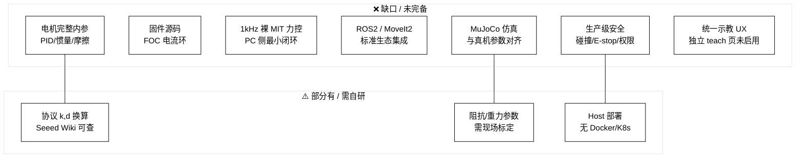
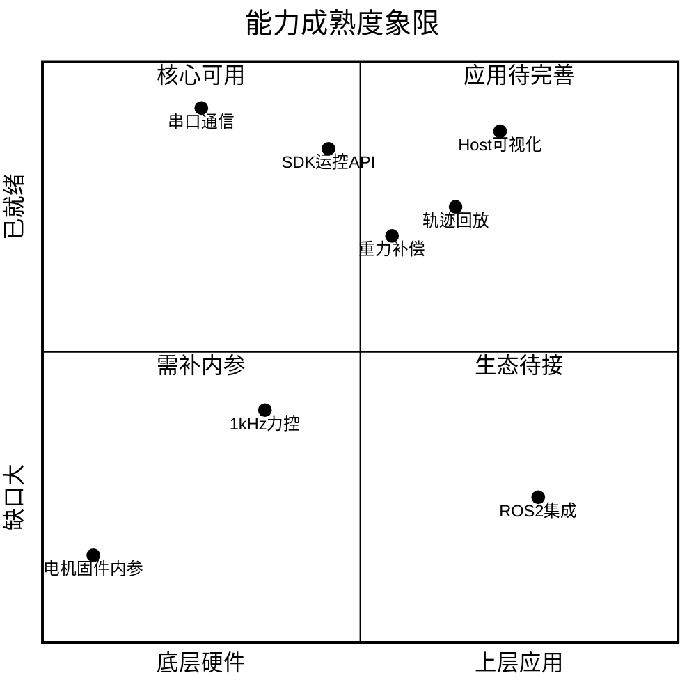

# Panthera-HT 系统架构：整体 / 现状 / 缺口

> 面向 TOPSUN 内部理解：Panthera-HT 六轴机械臂从浏览器到电机固件的完整技术栈，以及当前已具备与仍缺失的能力。

---

## 1. 整体是什么

Panthera-HT 是一套 **「Web 数字孪生 + Python/C++ SDK + 通信板 + 高擎关节模组」** 的分层机器人控制系统。  
PC 不直连 CAN，而是通过 **USB 串口 → Livelybot 通信板 → CAN/CAN-FD → 7 路电机** 完成闭环。

**说明（≤100字）：** 用户通过浏览器或脚本发指令，经 Host 后端或 SDK 封装，串口下发到通信板再转 CAN；电机固件执行位置/力矩/MIT 控制并回传状态。



---

## 2. 现在有什么（已具备）

按仓库 `topsun-bot/Panthera-HT` 当前状态，**软件链路已打通，真机可连、可视、可位置控制**。

**说明（≤100字）：** SDK 提供关节级与底层电机 API；Host 提供 3D 可视化与多种控制模式；YAML 配置了 7 电机型号；GitHub 已托管 mono-repo。



### 2.1 软件资产明细

| 模块 | 路径 | 能力 |
|------|------|------|
| Python SDK | `Panthera-HT_SDK/panthera_python/` | `hightorque_robot` whl、`Panthera.py` 封装、40+ 示例脚本 |
| C++ SDK | `Panthera-HT_SDK/panthera_cpp/` | `motor_cpp` 源码、`robot_cpp` 示例 |
| 电机协议 | `motor_cpp/include/hardware/` | `motor.hpp` 型号枚举、力矩修正系数、`serial_struct.hpp` |
| 机器人配置 | `robot_param/motor_param/*.yaml` | 7 电机 ID/型号/限位（J1=5047_36, J2/J3=6056_36 …） |
| Host 后端 | `Panthera-HT_Host/.../backend/app.py` | Flask + SocketIO，200Hz 控制 / 30Hz 广播 |
| Host 前端 | `Panthera-HT_Host/.../frontend/` | URDF 3D、滑条、拖关节、Waypoints、脚本面板 |
| 文档资源 | `Panthera-HT_Main/` | 官方说明与资产 |

### 2.2 电机型号（Follower 配置）

| 关节 | 型号 | SDK 力矩修正 |
|------|------|-------------|
| J1, J4 | 5047_36 | 0.4938（旧）/ 0.8030（5047_36_2 新） |
| J2, J3 | 6056_36 | 0.6770 |
| J5, J6 | 4438_30 | 0.5256 |
| J7 夹爪 | 3536_32 | 0.5948 |

### 2.3 已验证的运行链路

```
浏览器 localhost:3000
  → WebSocket → app.py (live)
  → Panthera / hightorque_robot
  → /dev/ttyACM0
  → CANboard → 7 电机 (v4.7~4.9)
  → 关节角回传 → 3D 模型同步
```

---

## 3. 缺什么（缺口分析）

**说明（≤100字）：** 公开资料与 SDK 覆盖通信和上层运控，但电机固件内参、1kHz 裸 MIT 环、ROS2/安全联锁、生产级 CI 等仍缺；示教页已开发但最终使用原版 Host。



### 3.1 缺口对照表

| 类别 | 缺口 | 影响 | 可行替代 |
|------|------|------|----------|
| **电机内参** | 电流环/速度环默认 PID、转子惯量 J、摩擦模型 | 精确力控/动力学仿真不准 | 用 SDK 封装 + 官方调试助手手调；或系统辨识 |
| **固件** | FOC 源码、出厂标定文件 | 无法二次开发电机底层 | 仅通过 CAN/串口寄存器调参 |
| **底层力控** | PC 侧 1kHz MIT 五参数裸循环模板 | 高性能柔顺控制受限 | `motor_example/08_pos_vel_torque_kp_kd_control.py` 作起点 |
| **中间件** | 无 ROS2 node、无 MoveIt2 配置包 | 难接入现有 ROS 产线 | 自行封装 `Panthera.py` 为 ROS2 节点 |
| **仿真** | MuJoCo 面板存在但未与真机参数对齐 | 离线验证不可靠 | 用 Pinocchio 重力补偿 + 手动填 URDF 惯量 |
| **安全** | 无碰撞检测、无硬件 E-stop 软件联动 | 产线部署风险 | 工作空间限位 + 人工监护（当前） |
| **运维** | 无 CI/CD、无一键部署镜像 | 团队协作成本高 | 现有 `backend.sh` / `frontend.sh` 手工启动 |
| **产品 UX** | 独立示教页 `teach.html` 已做但未作为主入口 | 示教体验未产品化 | 继续用 `index.html` 原 Host |

---

## 4. 三层能力成熟度（一图看清）

**说明（≤100字）：** 横轴为抽象层次，纵轴为成熟度。通信与可视化最成熟；电机内参与产线集成为主要短板。



---

## 5. 推荐下一步（按优先级）

1. **立即可用**：Live 模式 Host + `5_replay_trajectory.py` 做轨迹验证  
2. **短期补齐**：整理各关节公开规格 + SDK `motor_tqe_adj` 对照表，做力矩标定  
3. **中期自研**：ROS2 封装节点、1kHz MIT 控制环最小模板  
4. **长期向厂家要**：出厂 PID、惯量/friction 标定文件（非公开渠道）

---

## 6. 图例

| 符号 | 含义 |
|------|------|
| ✅ | 仓库已有且已验证 |
| ⚠️ | 部分公开 / 需现场标定 |
| ❌ | 缺失或未集成 |

---

*文档生成日期：2026-08-17 · 基于 topsun-bot/Panthera-HT 仓库现状*
